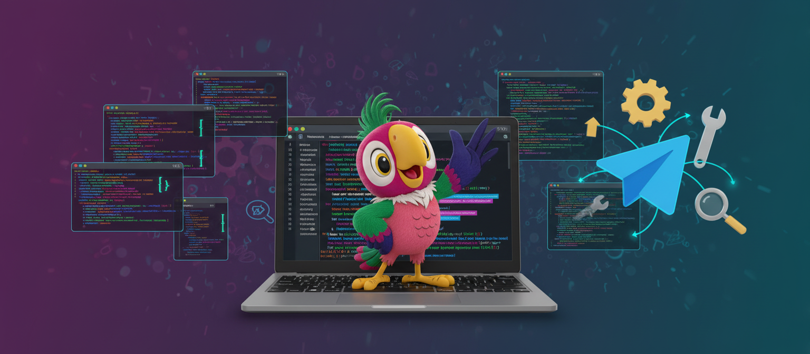

<p align="center">
  
</p>

# Kesha TG Bot

**v1.3.0** | [Changelog](CHANGELOG.md)

Telegram bot powered by **Claude Agent SDK** (official Anthropic SDK). A full Claude Code CLI experience, but through Telegram.

*[Русский](#русский) ниже.*

## What is this

One bot = one `claude` process with a persistent session. Like chatting in Claude Code terminal, but via Telegram. All CLAUDE.md, memory files, MCP servers, tools — picked up from the working directory.

## Features

- **Text** — regular messages → Claude responds with streaming
- **Photos** — downloaded, sent to Claude for analysis. Albums grouped correctly
- **Voice** — Deepgram STT → text → Claude
- **Video notes** — ffmpeg extracts audio → Deepgram STT → transcription
- **Documents** — downloads with original filename, Claude can read
- **Video / Audio** — downloads media with original names
- **Stickers** — passes emoji to Claude
- **Forwards** — tagged with [Forwarded from Name]
- **Replies** — quoted text included as [reply: "..."]
- **Native streaming** — real-time via `sendMessageDraft` (Bot API 9.5), no edit flickering
- **Smart tool display** — tools shown in ephemeral message, replaced by next text block
- **Persistent session** — survives bot restarts via `./storage/session_id`
- **Debounce** — batches rapid messages into one prompt (configurable delay)
- **Queue merge** — messages during processing merged into single batch
- **Media cache** — same file not re-downloaded (`file_unique_id` cache, persistent)
- **i18n** — Russian and English UI based on Telegram language
- **Message injection** — send messages while Claude is thinking, like in Claude Code CLI
- **Native interrupt** — `/stop` gracefully interrupts via SDK, preserves partial text
- **Persistent connection** — `ClaudeSDKClient` keeps connection alive between messages
- **Live model switch** — change model mid-conversation without losing context
- **Context tracking** — context usage percentage available via `get_bot_status`
- **Reminders** — 3 types: `plain` (raw text), `urgent_llm` (Claude formulates), `lazy_llm` (injected on next message). Persistent SQLite, repeat intervals, missed delivery on startup, TTL auto-promotion, retry with backoff on network errors
- **Reactions** — emoji reactions on messages via MCP tool
- **MCP tools** — send_photo, send_file, send_video, send_audio, send_voice, react, reminders (CRUD), self-config
- **Auto-retry** — on session error, auto-recreates (2 attempts). Urgent reminders retry 3x with backoff
- **Debug mode** — toggle with `/debug`, full logging to file
- **Media storage** — local `./storage/media/` with auto-cleanup (24h)

## Commands

| Command | Description |
|---------|-------------|
| `/start` | Bot status & session info |
| `/help` | Command reference |
| `/status` | Detailed status (model, uptime, rate limit, cost) |
| `/clear` | Reset session (new context) |
| `/ping` | Check if bot is alive |
| `/model <name>` | Change Claude model |
| `/debounce <sec>` | Message batching delay (0-30s) |
| `/debug` | Toggle debug logging |
| `/restart` | Restart bot service |

## Quick Start

```bash
git clone <repo-url> && cd kesha-tg-bot
python3 -m venv .venv && source .venv/bin/activate
pip install -r requirements.txt

# Interactive setup:
python setup_wizard.py

# Or manually:
cp .env.example .env
# Edit .env — set TELEGRAM_BOT_TOKEN

python bot.py
```

## Environment Variables (.env)

| Variable | Description | Default |
|----------|-------------|---------|
| `TELEGRAM_BOT_TOKEN` | Bot token from @BotFather | **required** |
| `ALLOWED_USERS` | Telegram user IDs, comma-separated | all |
| `CLAUDE_MODEL` | Claude model | claude-sonnet-4-6 |
| `WORK_DIR` | Working directory (with CLAUDE.md) | `.` (current) |
| `DEEPGRAM_API_KEY` | Deepgram key for voice/video note transcription | optional |
| `DEBUG` | Enable debug logging | false |
| `MEDIA_DIR` | Media storage path | ./storage/media |
| `LOG_DIR` | Log files path | ./logs |
| `DEBOUNCE_SEC` | Message batching delay | 3 |

## Systemd (auto-start)

```bash
sudo cp kesha-bot.service /etc/systemd/system/
sudo systemctl daemon-reload
sudo systemctl enable kesha-bot
sudo systemctl start kesha-bot
```

## Architecture

```
Telegram → Aiogram 3 → bot.py → claude_session.py → claude-agent-sdk → claude CLI (OAuth)
                          ↓              ↓
                   kesha_tools.py   StreamEvent (text_delta)
                   (MCP server)         ↓
                                  Real-time edit in TG
```

- `bot.py` — handlers, native draft streaming, debounce, media cache, album support, i18n
- `claude_session.py` — SDK wrapper with resume, streaming, injection, rate limit tracking
- `kesha_tools.py` — MCP tools (send_photo, send_file, schedule_message, self-config)
- `system_prompt.txt` — Claude's TG context and formatting rules
- `setup_wizard.py` — interactive first-run configuration

## Stack

- Python 3.11+
- aiogram 3.27+ (sendMessageDraft support) + aiogram-media-group
- claude-agent-sdk (official Anthropic)
- Deepgram Nova-2 (STT)
- ffmpeg (video note audio extraction)

---

# Русский

Телеграм-бот на **Claude Agent SDK** (официальный SDK от Anthropic). Полная копия Claude Code CLI, но через Telegram.

## Что это

Один бот = один `claude` процесс с persistent session. Как общаться в терминале Claude Code, только через ТГ. Все CLAUDE.md, memory, MCP серверы, tools — подхватываются из рабочей директории.

## Возможности

- **Текст** — сообщения → Claude отвечает со стримингом
- **Фото** — скачивает, передаёт Claude. Альбомы группируются
- **Голосовые** — Deepgram STT → текст → Claude
- **Видеокружки** — ffmpeg → Deepgram → транскрипция
- **Документы** — скачивает с оригинальным именем
- **Видео / Аудио** — скачивает с оригинальным именем
- **Стикеры** — передаёт emoji
- **Пересланные** — [Forwarded from Name]
- **Реплаи** — цитата [reply: "..."]
- **Нативный стриминг** — через `sendMessageDraft` (Bot API 9.5), без мерцания от editMessage
- **Умный показ тулов** — тулы в отдельном сообщении, заменяется следующим текстом
- **Persistent session** — переживает рестарт бота
- **Дебаунс** — склейка сообщений в один промпт (настраиваемая задержка)
- **Merge очереди** — сообщения во время обработки склеиваются в один батч
- **Кеш медиа** — не перекачивает файлы повторно (persistent cache)
- **i18n** — русский и английский по языку Telegram
- **Вклинивание сообщений** — пиши пока Claude думает, как в Claude Code CLI
- **Нативный interrupt** — `/stop` мягко прерывает через SDK, сохраняет текст
- **Persistent connection** — `ClaudeSDKClient` держит соединение между сообщениями
- **Live смена модели** — меняй модель без потери контекста
- **Контекст** — процент использования контекста через `get_bot_status`
- **Напоминания** — 3 типа: `plain` (текст как есть), `urgent_llm` (Claude формулирует сам), `lazy_llm` (вклинивается в следующее сообщение). Persistent SQLite, повторы, доставка пропущенных при старте, автопромоушен по TTL, retry с backoff при ошибках сети
- **Реакции** — эмодзи-реакции на сообщения через MCP tool
- **MCP tools** — send_photo, send_file, send_video, send_audio, send_voice, react, напоминания (CRUD), самонастройка
- **Auto-retry** — при ошибке сессии пересоздаёт (2 попытки). Urgent напоминания — retry 3x с backoff
- **Debug** — `/debug`, полное логирование в файл
- **Хранилище медиа** — `./storage/media/` с автоочисткой (24ч)

## Команды

| Команда | Описание |
|---------|----------|
| `/start` | Статус бота и сессии |
| `/help` | Справка по командам |
| `/status` | Подробный статус (модель, uptime, rate limit, стоимость) |
| `/clear` | Сбросить сессию |
| `/ping` | Проверить что бот жив |
| `/model <name>` | Сменить модель |
| `/debounce <sec>` | Задержка склейки (0-30 сек) |
| `/debug` | Вкл/выкл debug логирование |
| `/restart` | Перезапустить бота |

## Быстрый старт

```bash
git clone <repo-url> && cd kesha-tg-bot
python3 -m venv .venv && source .venv/bin/activate
pip install -r requirements.txt

# Интерактивная настройка:
python setup_wizard.py

# Или вручную:
cp .env.example .env
# Отредактировать .env — вписать TELEGRAM_BOT_TOKEN

python bot.py
```

## Переменные окружения (.env)

| Переменная | Описание | По умолчанию |
|------------|----------|--------------|
| `TELEGRAM_BOT_TOKEN` | Токен бота из @BotFather | **обязательно** |
| `ALLOWED_USERS` | Telegram user IDs через запятую | все |
| `CLAUDE_MODEL` | Модель Claude | claude-sonnet-4-6 |
| `WORK_DIR` | Рабочая директория (с CLAUDE.md) | `.` (текущая) |
| `DEEPGRAM_API_KEY` | Ключ Deepgram для голосовых/кружочков | опционально |
| `DEBUG` | Включить debug логирование | false |
| `MEDIA_DIR` | Путь для хранения медиа | ./storage/media |
| `LOG_DIR` | Путь для логов | ./logs |
| `DEBOUNCE_SEC` | Задержка склейки сообщений | 3 |
