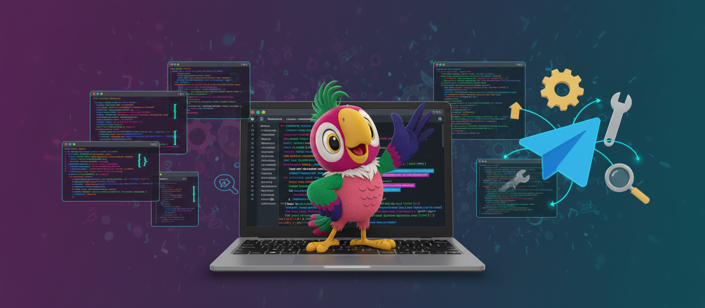

<p align="center">
  
</p>

# Kesha TG Bot

**v2.7.0** | [Changelog](CHANGELOG.md)

Telegram bot powered by **Claude Agent SDK** (official Anthropic SDK), with a second runtime on the **Codex CLI** for emergencies. A full Claude Code CLI experience, but through Telegram.

*[Русский](#русский) ниже.*

## What is this

One chat = one agent process with a persistent session. Like chatting in a Claude Code terminal, but via Telegram. All CLAUDE.md, memory files, MCP servers, tools — picked up from the working directory.

## Features

- **Text** — regular messages → streaming answer edited live in place
- **Photos** — downloaded, sent to the model for analysis. Albums grouped correctly
- **Voice** — Deepgram STT → text → model
- **Video notes** — ffmpeg extracts audio → Deepgram STT → transcription
- **Documents** — downloads with original filename, the model can read them
- **Video / Audio** — downloads media with original names
- **Stickers** — passes emoji through
- **Forwards** — tagged with [Forwarded from Name]
- **Replies** — quoted text included as [reply: "..."]
- **Smart tool display** — tool calls shown in a separate live bubble with timers, replaced by the next text block
- **Context tracking** — context usage percentage via `get_bot_status` (Claude; on Codex only after the first turn reports usage)
- **Two runtimes** — Claude (default) and Codex, switched manually with `/runtime`. Each chat keeps its own session file per runtime, so switching back resumes that runtime's own history
- **Canonical `/limits`** — forwards Orchestra's exact Claude/Codex/Spark/Grok card, including measured Claude weekly headroom and burn pace
- **Per-chat edit budget** — streaming stays visible under Telegram flood control: when edits are rate-limited it falls back to send+delete instead of freezing
- **Persistent session** — survives bot restarts via `storage/sessions/<chat_id>`
- **Debounce** — batches rapid messages into one prompt (configurable delay)
- **Queue merge** — messages arriving during processing are deferred and merged into the next batch
- **Media cache** — same file not re-downloaded (`file_unique_id` cache, persistent)
- **i18n** — Russian and English UI based on Telegram language
- **Native interrupt** — `/stop` gracefully interrupts, preserves partial text
- **Persistent connection** — the client stays alive between messages
- **Night-only auto-compaction** — automatic compaction runs in the 23:00–08:00 window; during the day a fail-closed context reserve admits a message only if enough context is left
- **Context reserve** — a message is never sent into a context that cannot hold the answer; the refusal names the real reason instead of failing silently
- **RAG semantic memory** — hybrid search (bge-m3 int8 + sqlite-vec + FTS5) over both the dialogue history and `.md`/`.txt` knowledge-base files, live-updated by a filesystem watcher
- **Reminders** — 3 types: `plain` (alarm/buzzer, raw text), `urgent_llm` (task for the bot at a specific time — check servers, read mail, etc.), `lazy_llm` (silent note injected on next user message). Persistent SQLite, repeat intervals, missed delivery on startup, TTL auto-promotion, retry 3x with backoff
- **Reactions** — emoji reactions on messages via MCP tool
- **MCP tools** — send_photo, send_file, send_video, send_audio, send_voice, react, reminders (CRUD), search_memory, self-config, run_on_laptop
- **Sandboxed file sending** — outgoing files must resolve inside a whitelist of roots; symlink, hardlink and TOCTOU escapes are rejected at read time
- **Multi-user** — each chat gets its own isolated session. Parallel processing, no cross-chat leaking
- **Auto-retry** — on transient session errors the session is recreated; quota limits are reported, never retried
- **Debug mode** — toggle with `/debug`, full logging to file
- **Media storage** — local `./storage/media/` with auto-cleanup (24h)

## Commands

| Command | Description |
|---------|-------------|
| `/start` | Bot status & session info |
| `/help` | Command reference |
| `/status` | Detailed status (model, uptime, context, cost) |
| `/limits` | Canonical Claude, Codex, Spark and Grok limits card from Orchestra |
| `/clear` | Reset session (new context) |
| `/compact` | Compact context into a summary and continue |
| `/runtime` | Show the current runtime and its model |
| `/runtime <claude\|codex>` | Switch this chat to another runtime (only while idle) |
| `/stop` | Interrupt the current answer |
| `/ping` | Check if bot is alive |
| `/debounce <sec>` | Message batching delay (0-30s) |
| `/debug` | Toggle debug logging |
| `/restart` | Restart bot service |

## Runtimes

The bot speaks to two backends through one narrow protocol (`runtime_protocol.py`). Claude is the default and the only one with production mileage.

| | Claude | Codex |
|---|---|---|
| Backend | `claude-agent-sdk` | `codex app-server` (JSON-RPC) |
| Default model | `CLAUDE_MODEL` | `KESHA_CODEX_MODEL` |
| Compaction | Kesha's own (summarize → reset → continue) | native `thread/compact/start` |
| Context percentage | yes | only after the first turn reports usage |
| Cost reporting | yes | no (subscription auth) |

Switching is **manual and meant as an emergency fallback** — there is no automatic failover. `/runtime codex` carries the recent history over as a summary; if the target runtime fails to come up, the bot says so in the chat and stays where it is. Codex-side MCP tools are served over a local unix socket bridge (`tool_bridge.py`) with a capability token, per-chat addressing and TTL; `run_on_laptop` is permanently excluded from that bridge.

## Quick Start

```bash
git clone <repo-url> && cd kesha-tg-bot
python3 -m venv .venv && source .venv/bin/activate
pip install -r requirements.txt

# Interactive setup:
python setup_wizard.py

# Or manually:
cp .env.example .env
# Edit .env — set TELEGRAM_BOT_TOKEN

python bot.py
```

## Environment Variables (.env)

| Variable | Description | Default |
|----------|-------------|---------|
| `TELEGRAM_BOT_TOKEN` | Bot token from @BotFather | **required** |
| `ALLOWED_USERS` | Telegram user IDs, comma-separated | all |
| `CLAUDE_MODEL` | Claude model | claude-opus-5 |
| `WORK_DIR` | Working directory (with CLAUDE.md, also the RAG knowledge base) | `.` (current) |
| `KESHA_RUNTIME` | Startup runtime: `claude` or `codex` | claude |
| `KESHA_CODEX_MODEL` | Model for the Codex runtime | gpt-5.6-sol |
| `KESHA_CODEX_BIN` | Path to the `codex` binary | autodetected |
| `KESHA_CODEX_HOME` | Private `CODEX_HOME` isolating the bot from your own Codex MCP servers | `<session dir>` |
| `KESHA_SENDABLE_ROOTS` | Colon-separated roots files may be sent from | `./storage:./artifacts:/tmp/kesha` |
| `KESHA_BRIDGE_SOCKET` | Unix socket for the Codex tool bridge | ./storage/bridge.sock |
| `DEEPGRAM_API_KEY` | Deepgram key for voice/video note transcription | optional |
| `DEBUG` | Enable debug logging | false |
| `MEDIA_DIR` | Media storage path | ./storage/media |
| `MEDIA_MAX_MB` | Max media size to download | 100 |
| `LOG_DIR` | Log files path | ./logs |
| `DEBOUNCE_SEC` | Message batching delay | 3 |
| `NOTIFY_CHAT` | Chat for reminders/system notices | first of `ALLOWED_USERS` |
| `ORCHESTRA_URL` | Local Orchestra API used by `/limits` | `http://127.0.0.1:8888` |
| `ORCHESTRA_ENV_FILE` | Shared Orchestra env file containing `INTERNAL_TOKEN` | `/home/kesha/orchestra/.env` |

## Systemd (auto-start)

```bash
sudo cp kesha-bot.service /etc/systemd/system/
sudo systemctl daemon-reload
sudo systemctl enable kesha-bot
sudo systemctl start kesha-bot
```

## Architecture

```
Telegram → Aiogram 3 → handlers.py → chat_state.py → runtime_registry.py
                                          ↓                    ↓
                                  response_stream.py    claude_session.py → claude-agent-sdk → claude CLI
                                          ↓             codex_session.py  → codex app-server (JSON-RPC)
                                  live edit in TG              ↓
                                                        tool_bridge.py → kesha_tools.py (MCP)
```

- `bot.py` — bootstrap: bot/dispatcher, singleton lock, wiring
- `handlers.py` — all message and command handlers
- `chat_state.py` — per-chat state machine, debounce, runtime switching, compaction dispatch
- `response_stream.py` — streaming, per-chat edit budget, tool status, retries
- `runtime_protocol.py` / `runtime_registry.py` — the runtime contract and its fail-loud registry
- `claude_session.py` / `codex_session.py` — the two backend adapters
- `limits.py` / `quota_gate.py` — canonical Orchestra limits delivery / minimal provider admission check
- `tool_bridge.py` — unix-socket MCP bridge for the Codex runtime (capability token, TTL)
- `file_access.py` — whitelist + TOCTOU-safe reads for outgoing files
- `kesha_tools.py` — MCP tools (media, reactions, reminders CRUD, search_memory, self-config)
- `compact.py` — context compaction (summarize → reset → continue)
- `rag.py` — semantic memory over dialogues and knowledge-base files
- `reminders.py`, `message_log.py`, `media.py`, `telegram_io.py`, `tool_status.py` — supporting modules
- `system_prompt.txt` — the bot's TG context and formatting rules

## Stack

- Python 3.12+
- aiogram 3.28+ + aiogram-media-group
- claude-agent-sdk 0.2.128+ (official Anthropic)
- Codex CLI (`codex app-server`) — optional, only for the second runtime
- fastembed (bge-m3 int8) + sqlite-vec + FTS5 — RAG
- watchfiles — knowledge-base watcher
- Deepgram Nova-2 (STT)
- ffmpeg (video note audio extraction)

---

# Русский

Телеграм-бот на **Claude Agent SDK** (официальный SDK от Anthropic), со вторым рантаймом на **Codex CLI** для аварийных случаев. Полная копия Claude Code CLI, но через Telegram.

## Что это

Один чат = один процесс агента с persistent session. Как общаться в терминале Claude Code, только через ТГ. Все CLAUDE.md, memory, MCP серверы, tools — подхватываются из рабочей директории.

## Возможности

- **Текст** — сообщения → ответ стримится и правится на месте
- **Фото** — скачивает, передаёт модели. Альбомы группируются
- **Голосовые** — Deepgram STT → текст → модель
- **Видеокружки** — ffmpeg → Deepgram → транскрипция
- **Документы** — скачивает с оригинальным именем, модель может читать
- **Видео / Аудио** — скачивает с оригинальным именем
- **Стикеры** — передаёт emoji
- **Пересланные** — [Forwarded from Name]
- **Реплаи** — цитата [reply: "..."]
- **Умный показ тулов** — вызовы тулов в отдельном живом пузыре с таймерами, заменяется следующим текстом
- **Контекст** — процент использования через `get_bot_status` (на Claude; на Codex — только после первого хода с usage)
- **Два рантайма** — Claude (по умолчанию) и Codex, переключение вручную через `/runtime`. У каждого чата свой файл сессии на каждый рантайм, поэтому возврат обратно продолжает его собственную историю
- **Канонический `/limits`** — пересылает точную карточку Orchestra для Claude/Codex/Spark/Grok с недельным остатком Claude и темпом расхода
- **Общий бюджет правок на чат** — стриминг остаётся видимым при флуд-контроле Telegram: когда правки упираются в лимит, бот переходит на send+delete вместо заморозки
- **Persistent session** — переживает рестарт бота (`storage/sessions/<chat_id>`)
- **Дебаунс** — склейка сообщений в один промпт (настраиваемая задержка)
- **Merge очереди** — сообщения во время обработки откладываются и склеиваются в следующий батч
- **Кеш медиа** — не перекачивает файлы повторно (persistent cache)
- **i18n** — русский и английский по языку Telegram
- **Нативный interrupt** — `/stop` мягко прерывает, сохраняет текст
- **Persistent connection** — клиент держится между сообщениями
- **Автокомпакт только ночью** — автоматическое сжатие работает в окне 23:00–08:00, днём сообщение пропускается только если хватает резерва контекста (fail-closed)
- **Резерв контекста** — сообщение не уходит в контекст, который не вместит ответ; отказ называет настоящую причину, а не молчит
- **RAG семантическая память** — гибридный поиск (bge-m3 int8 + sqlite-vec + FTS5) по истории диалогов И по файлам `.md`/`.txt` базы знаний, индекс обновляется вотчером в реальном времени
- **Напоминания** — 3 типа: `plain` (будильник, чистый текст), `urgent_llm` (задание для бота в конкретное время — проверить сервер, почту и т.д.), `lazy_llm` (тихая заметка, вклеивается при следующем сообщении). Persistent SQLite, повторы, доставка пропущенных при старте, автопромоушен по TTL, retry 3x с backoff
- **Реакции** — эмодзи-реакции на сообщения через MCP tool
- **MCP tools** — send_photo, send_file, send_video, send_audio, send_voice, react, напоминания (CRUD), search_memory, самонастройка, run_on_laptop
- **Песочница отправки файлов** — исходящий файл обязан резолвиться внутрь белого списка корней; симлинк, хардлинк и TOCTOU-подмена отсекаются в момент чтения
- **Мультиюзер** — каждый чат получает изолированную сессию. Параллельная обработка, ответы не смешиваются
- **Auto-retry** — транзиентные ошибки сессии пересоздают сессию; лимиты квоты сообщаются, но НИКОГДА не ретраятся
- **Debug** — `/debug`, полное логирование в файл
- **Хранилище медиа** — `./storage/media/` с автоочисткой (24ч)

## Команды

| Команда | Описание |
|---------|----------|
| `/start` | Статус бота и сессии |
| `/help` | Справка по командам |
| `/status` | Подробный статус (модель, uptime, контекст, стоимость) |
| `/limits` | Каноническая карточка лимитов Claude, Codex, Spark и Grok из Orchestra |
| `/clear` | Сбросить сессию |
| `/compact` | Сжать контекст в выжимку и продолжить |
| `/runtime` | Показать текущий рантайм и его модель |
| `/runtime <claude\|codex>` | Переключить чат на другой рантайм (только когда бот свободен) |
| `/stop` | Прервать текущий ответ |
| `/ping` | Проверить что бот жив |
| `/debounce <sec>` | Задержка склейки (0-30 сек) |
| `/debug` | Вкл/выкл debug логирование |
| `/restart` | Перезапустить бота |

## Рантаймы

Бот говорит с двумя бэкендами через один узкий протокол (`runtime_protocol.py`). Claude — дефолт и единственный с боевым пробегом.

| | Claude | Codex |
|---|---|---|
| Бэкенд | `claude-agent-sdk` | `codex app-server` (JSON-RPC) |
| Модель по умолчанию | `CLAUDE_MODEL` | `KESHA_CODEX_MODEL` |
| Сжатие контекста | своё (выжимка → reset → продолжение) | нативное `thread/compact/start` |
| Процент контекста | есть | только после первого хода с usage |
| Стоимость | есть | нет (авторизация по подписке) |

Переключение **ручное и задумано как аварийный вариант** — автоматического failover нет. `/runtime codex` переносит недавнюю историю выжимкой; если целевой рантайм не поднялся, бот говорит об этом в чат и остаётся на текущем. MCP-тулы для Codex отдаются через локальный unix-сокет (`tool_bridge.py`) с capability-токеном, адресацией по чату и TTL; `run_on_laptop` из этого моста исключён навсегда.

## Быстрый старт

```bash
git clone <repo-url> && cd kesha-tg-bot
python3 -m venv .venv && source .venv/bin/activate
pip install -r requirements.txt

# Интерактивная настройка:
python setup_wizard.py

# Или вручную:
cp .env.example .env
# Отредактировать .env — вписать TELEGRAM_BOT_TOKEN

python bot.py
```

## Переменные окружения (.env)

| Переменная | Описание | По умолчанию |
|------------|----------|--------------|
| `TELEGRAM_BOT_TOKEN` | Токен бота из @BotFather | **обязательно** |
| `ALLOWED_USERS` | Telegram user IDs через запятую | все |
| `CLAUDE_MODEL` | Модель Claude | claude-opus-5 |
| `WORK_DIR` | Рабочая директория (с CLAUDE.md, она же база знаний для RAG) | `.` (текущая) |
| `KESHA_RUNTIME` | Рантайм при старте: `claude` или `codex` | claude |
| `KESHA_CODEX_MODEL` | Модель для рантайма Codex | gpt-5.6-sol |
| `KESHA_CODEX_BIN` | Путь к бинарю `codex` | автоопределение |
| `KESHA_CODEX_HOME` | Приватный `CODEX_HOME` — изолирует бота от твоих собственных MCP-серверов Codex | `<каталог сессий>` |
| `KESHA_SENDABLE_ROOTS` | Корни, откуда разрешено отправлять файлы (через `:`) | `./storage:./artifacts:/tmp/kesha` |
| `KESHA_BRIDGE_SOCKET` | Unix-сокет моста тулов для Codex | ./storage/bridge.sock |
| `DEEPGRAM_API_KEY` | Ключ Deepgram для голосовых/кружочков | опционально |
| `DEBUG` | Включить debug логирование | false |
| `MEDIA_DIR` | Путь для хранения медиа | ./storage/media |
| `MEDIA_MAX_MB` | Максимальный размер скачиваемого медиа | 100 |
| `LOG_DIR` | Путь для логов | ./logs |
| `DEBOUNCE_SEC` | Задержка склейки сообщений | 3 |
| `NOTIFY_CHAT` | Чат для напоминаний и системных уведомлений | первый из `ALLOWED_USERS` |
| `ORCHESTRA_URL` | Локальный API Orchestra для `/limits` | `http://127.0.0.1:8888` |
| `ORCHESTRA_ENV_FILE` | Общий env Orchestra с `INTERNAL_TOKEN` | `/home/kesha/orchestra/.env` |

## Архитектура

```
Telegram → Aiogram 3 → handlers.py → chat_state.py → runtime_registry.py
                                          ↓                    ↓
                                  response_stream.py    claude_session.py → claude-agent-sdk → claude CLI
                                          ↓             codex_session.py  → codex app-server (JSON-RPC)
                                    живая правка в ТГ          ↓
                                                        tool_bridge.py → kesha_tools.py (MCP)
```

- `bot.py` — бутстрап: бот/диспетчер, singleton lock, сборка зависимостей
- `handlers.py` — все хендлеры сообщений и команд
- `chat_state.py` — стейт-машина чата, дебаунс, переключение рантайма, диспетчер компакта
- `response_stream.py` — стриминг, общий бюджет правок на чат, статус тулов, ретраи
- `runtime_protocol.py` / `runtime_registry.py` — контракт рантайма и его fail-loud реестр
- `claude_session.py` / `codex_session.py` — два адаптера бэкендов
- `limits.py` / `quota_gate.py` — доставка канонических лимитов Orchestra / минимальный admission-гейт провайдера
- `tool_bridge.py` — MCP-мост через unix-сокет для рантайма Codex (capability-токен, TTL)
- `file_access.py` — whitelist и TOCTOU-безопасное чтение для исходящих файлов
- `kesha_tools.py` — MCP tools (медиа, реакции, напоминания CRUD, search_memory, самонастройка)
- `compact.py` — сжатие контекста (выжимка → reset → продолжение)
- `rag.py` — семантическая память по диалогам и файлам базы знаний
- `reminders.py`, `message_log.py`, `media.py`, `telegram_io.py`, `tool_status.py` — вспомогательные модули
- `system_prompt.txt` — TG-контекст и правила форматирования для бота

## Стек

- Python 3.12+
- aiogram 3.28+ + aiogram-media-group
- claude-agent-sdk 0.2.128+ (официальный Anthropic)
- Codex CLI (`codex app-server`) — опционально, только для второго рантайма
- fastembed (bge-m3 int8) + sqlite-vec + FTS5 — RAG
- watchfiles — вотчер базы знаний
- Deepgram Nova-2 (STT)
- ffmpeg (извлечение аудио из кружочков)
